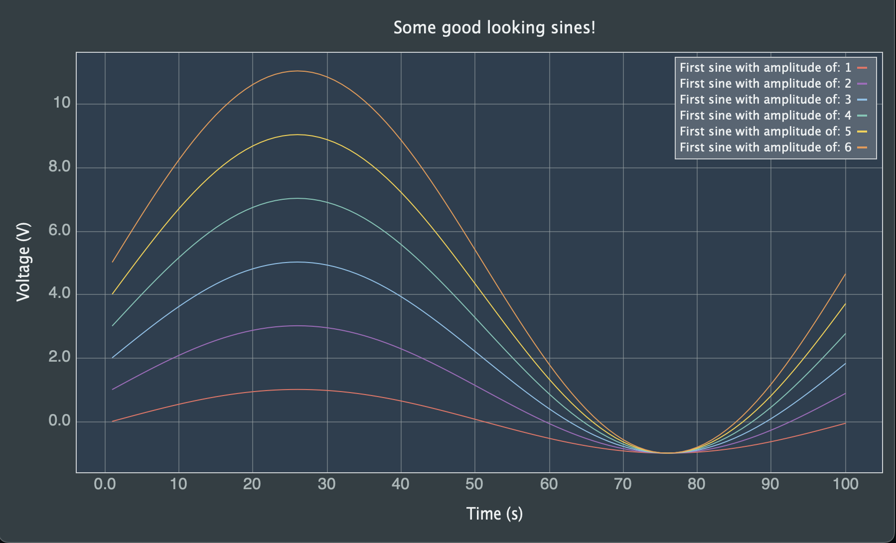
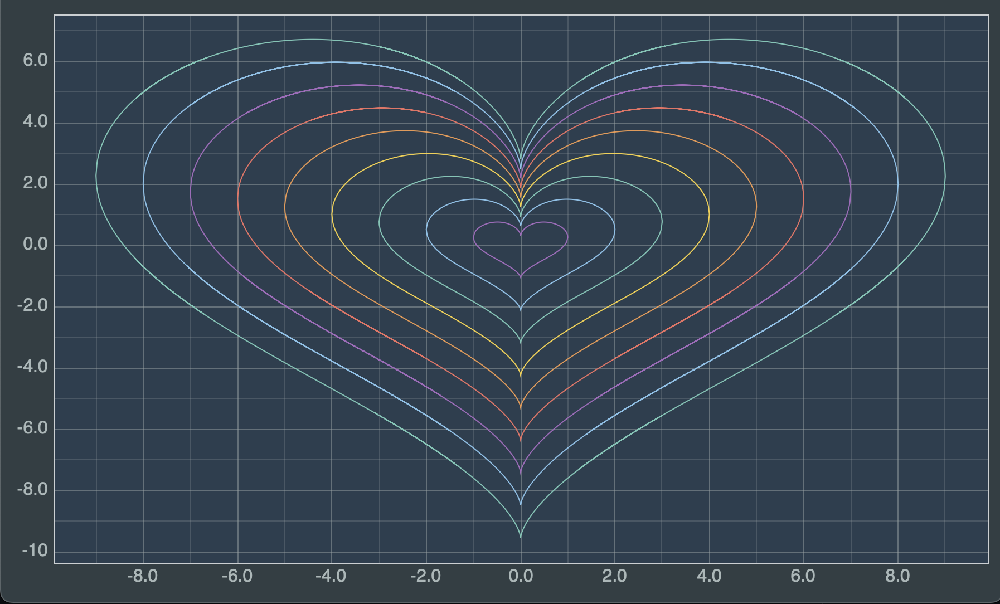
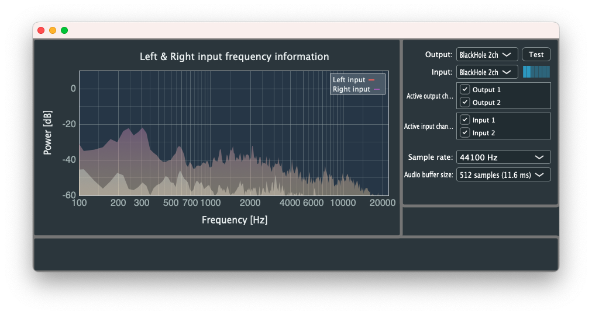

# CustomMatPlot
## Plot library for the JUCE Framework

CustomMatPlot (CMP) is a plotting library for C++. It provides an API for embedding plot components into applications using the JUCE framework. The plot component is easy to integrate and is customizable using the included lookandfeel class.

|   | |
| ------------- | ------------- |

> Note: I'm not a senior developer so there may be several design flaws.

## Table of Content
  - [Features](#features)
  - [Requirements](#requirements)
  - [Controls](#controls)
  - [LookAndFeel](#lookandfeel)
  - [Graph line attributes](#graph-line-attributes)
  - [Examples](#examples)
  - [Realtime frequency response example](#realtime-frequency-response-example)
  - [Tests](#tests)
  - [License](#license)

## Features
<a name="features"></a>

CMP implements many of the same features that exist in Matplotlib.
Below is the feature list of CMP:

- Axis scaling: Linear and logarithmic.
- Customizable view using the lookandfeel class.
- Legend.
- Zoom.
- Trace.
- Fill area between two graphs.
- Axis labels.
- Ticks and Tick-labels.
- Grids and tiny grids.
- Markers: Star, triangles, square etc.
- Custom stroke path.
- Callback for every visible data point.
- Callback for tace points.
- Two different downsampler levels 

 

## Requirements
<a name="requirements"></a>

- Compiler that supports C++20  (TODO: Make it support 17)
- CMake 3.12

## Controls
<a name="controls"></a>

The CMP compontent implements MouseEvents to interact with the plot using the mouse. Below is a list with the current added mouse commands:

1. Left click drag anywhere in the graph area to zoom into the plot. The zoom area is displayed as traced lined rectangle.
2. Right click to zoom out to home.
3. Double-click to add a trace-point to the graph lines closest to the mouse pointer.
4. Double-click on a trace-point to remove it.
5. Drag the trace point to move it along the graph-line.
6. Move the trace point label by dragging it.
7. Move the legend to by dragging it.
8. [TODO] Panning

## LookAndFeel
<a name="lookandfeel"></a>

Customize the plot to your liking by overriding the lookandfeel functions. See the lookandfeel example.


## Graph line attributes
<a name="graph-line-attributes"></a>

Use the graph line attributes to change the appearance of the graph lines. See custom_graph_attributes example.


## Examples
<a name="examples"></a>
The examples can be built using the following commands:

```sh
# Clone repository
git clone https://github.com/franshej/CustomMatPlot.git

cd CustomMatPlot

# Update submodules
git submodule update --init

mkdir build
cd build

# Config & build
cmake ../ -DCMP_BUILD_EXAMPLES=ON
make -j4
```

## Realtime frequency response example app
<a name="realtime-frequency-response-example"></a>

An example app plotting the frequency response of the incoming left and right audio signals can be seen here: <a href="https://github.com/franshej/Realtime-Frequency-Plot-Example"> Realtime plot example </a>



## Tests
<a name="tests"></a>
To make it more convenient to write new tests the CMP library implements tests macros similar to the macros in google tests.

The following example below will plot a ramp of 10 values from 0-9:
```cpp
TEST(ramp, non_real_time) {
  ADD_PLOT;

  std::vector<float> y_test_data(10u);
  std::iota(y_test_data.begin(), y_test_data.end(), 0.0f);

  PLOT_Y({y_test_data});
}
```


## License
<a name="license"></a>

The MIT License (MIT)

Copyright (c) 2017-2022 Frans Rosencrantz

**Free Software, Hell Yeah!**
